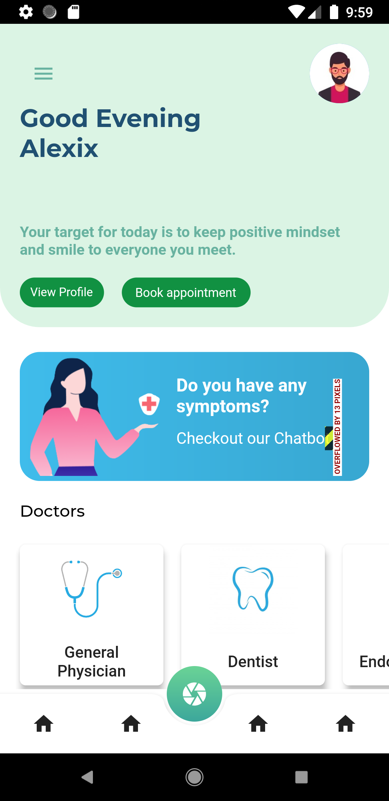
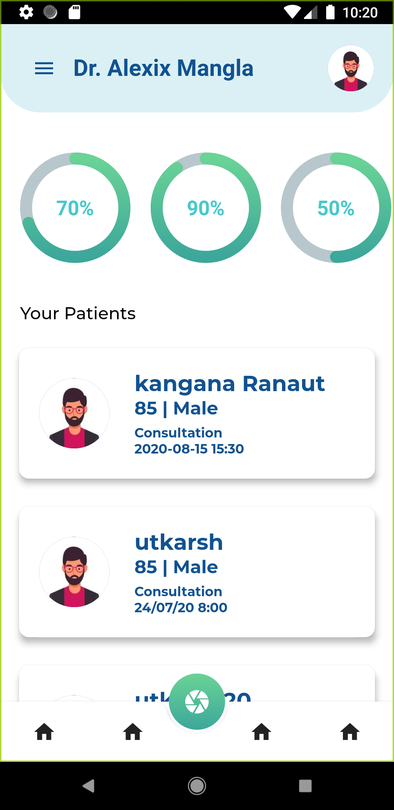

	<h2 align="center">  Curae - Your Health Our Priority  </h2>
	<h4 align="center">  Curae App which has a capability to store the medical data of the patient automatically and it is stored in cloud to prevent from the data breach. This Curae App brings -transparency in the Medical Sector. As our App will bring the whole Medical Sector into one platform i.e. patient, doctor, diagnostic center and pharmacy, which make it easier for file sharing. We are also integrating our Machine Learning Model which enhances the capability to predict the reason for his/her illness based on the patient’s input symptoms. 
 <h4>

---

  

## Preview
 
 

## Functionalities
- [x] This App will make a bridge between the Patient and Hospital, which will not only help patients to reach to the nearest Hospital but also notify the patient about the availability of beds. 

- [x] If a patient is in a critical situation, just with a single click an ambulance can be called as well as it will notify the Hospital about the patient’s arrival, so that the Hospital can prepare themself for this situation.

- [x] As all the Medical data of the patient is in the cloud, which makes it easier to  access from everywhere.

- [x] We also provide features to add your family doctor, which makes it easier for the doctor to track your health and alert you whenever it is necessary

- [x] This App establishes direct connections to the laboratory, diagnostic centre and Hospitals which reduces the corruption and involvement of third parties.

- [x] This App also covers all that common features that other apps have like Online Appointment with the doctor, Video Calling Facility , home delivery of medicine , etc.

- [x] The app will reduce the stressful working hours for the doctors.

## Open Resources Used
- [x] Rasa Machine Learning Framework
- [x] Flutter

## Contributors

<table width:75%>
<tr align="center">

<td widht:100%>

Aditya Mangla

</td>

<td widht:25%>

Arijit Mukherjee

</td>

<td widht:25%>

Harsh Gour

</td>

</tr>
  </table>
  

	Made with :heart: by the <a href="">NutriCal Team</a>

# Curae
Curae-Your health Our Priority

Curae App which has a capability to store the medical data of the patient automatically and it is stored in cloud to prevent from the data breach. This Curae App brings -transparency in the Medical Sector. As our App will bring the whole Medical Sector into one platform i.e. patient, doctor, diagnostic center and pharmacy, which make it easier for file sharing. We are also integrating our Machine Learning Model which enhances the capability to predict the reason for his/her illness based on the patient’s input symptoms. 

### Problem Overview:
[] Patient records are not digitalized/transcribed
[] Medical records of the patient are not readily available or accessible online or on demand by the patients or the hospitals.
[] Many times death occurs due to lack of data transparency in the health sector hampering patients’ abilities to make informed decisions.
[] Long waiting queues and difficulty in appointment booking.
[] Difficulties in gathering and giving out information about each and every patient at every smallest stage.
[] Difficulties in gathering and giving out information about each and every patient at every smallest stage.

### SOlution:
To solve all these issues we are coming forward with a Curae App which has a capability to store the medical data of the patient automatically and it is stored in cloud to prevent from the data breach.This Curae App brings -transparency in the Medical Sector. As our App will bring the whole Medical Sector into one platform,i.e patient, doctor, diagnostic center and pharmacy, which make it easier for file sharing. We are also integrating our Machine Learning Model which enhances the capability to predict the reason for his/her illness based on the patient’s input symptoms. This decreases the work-load on the doctor as the machine learning model is being trained by the person’s medical past history. 

### Features Of Our Curae App:
This App will make a bridge between the Patient and Hospital, which will not only help patients to reach to the nearest Hospital but also notify the patient about the availability of beds. 
If a patient is in a critical situation, just with a single click an ambulance can be called as well as it will notify the Hospital about the patient’s arrival, so that the Hospital can prepare themself for this situation.
As all the Medical data of the patient is in the cloud, which makes it easier to  access from everywhere.
We also provide features to add your family doctor, which makes it easier for the doctor to track your health and alert you whenever it is necessary
This App establishes direct connections to the laboratory, diagnostic centre and Hospitals which reduces the corruption and involvement of third parties.
This App also covers all that common features that other apps have like Online Appointment with the doctor, Video Calling Facility , home delivery of medicine , etc..
The app will reduce the stressful working hours for the doctors.

Now the question arises, how will this app help the Government?
With the help of the medical history stored, the app's database will give a graphical representation of the number of the highest spread diseases  in a particular area. 
It will also give the data which would tell the number of patients that have been infected with a certain disease and what is the exact cause of the disease.
Solutions will be given based on the app's data so as to improve the health of people, living in that particular area. Spread of diseases in any particular area of the city, an instant notification will be sent to the state government.
The pharmacists have to keep a record of the amount of medicines that are being consumed by the people. Once they register through our app, this will be done automatically. The app will scan and store the data methodically along with the name and other personal details, date of consumption, amount of consumption. 
 A graphical representation based on the amount of medicines bought, the dosage consumed by the people, will be given; based on the pharmacists' data,so that the people consuming excess of drugs without medical supervision can be tracked.
 Our app will be registering people based on their Aadhaar identification. This will also help us track the illicit consumption and unlawful selling of drugs at a low price. The data can also be sent to the government.
The base of this app should be the capability of aggregating all the data into a larger data warehouse and reducing the speed of mining data out of the data warehouse. The criticality of data mining at the most correct instances would improve the usability of the solution.
